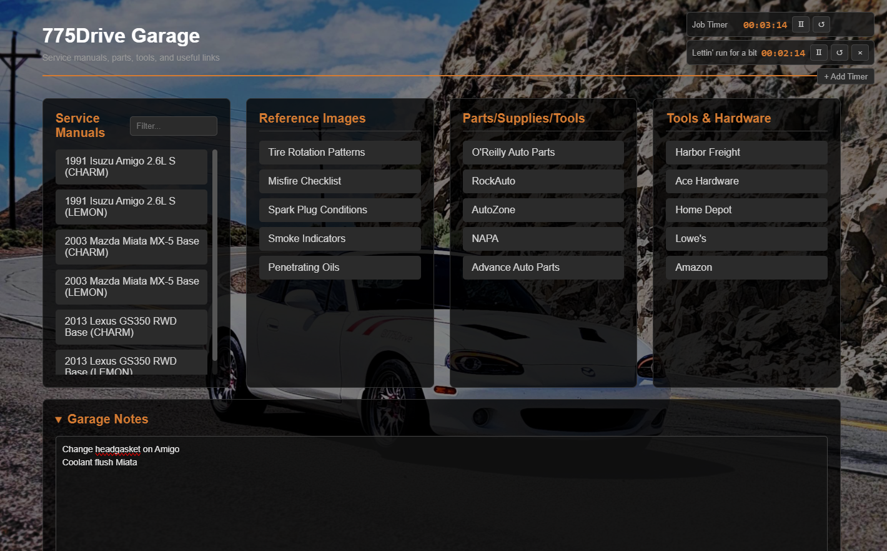

# 775Drive Garage Dashboard

775Drive Garage Dashboard is a simple, offline dashboard that puts useful garage-related tools and resources on a single page in a clean, easy-to-use layout.

There are no dependencies, servers, or installation steps. Download the repository and open Garage Dashboard.html.

## Screenshot

## Features
- 📖 Service manuals with filtering
- 🖼️ Reference images for quick visual references
- 🔧 Parts, supplies, and tools links
- ⏱️ Persistent Job Timer plus as many labeled sub-timers as you need
- 📝 Persistent Garage Notes
- 🖼️ Static background for some personality
- 🔗 775Drive right there at the bottom

## Service Manuals

The dashboard does not include any service manuals, but offline manuals can be downloaded from the resources below.

Download and extract the manual into the same folder as the dashboard, then modify the Service Manuals section of Garage Dashboard.html to link to its index.html file.

A few example service manual links are included in the dashboard to demonstrate the expected format.

## Customization

To change the dashboard background, simply replace back.jpg with your own image using the same filename.

The links under Parts/Supplies/Tools, Tools & Hardware, and Reference Images can also be edited directly in Garage Dashboard.html to suit your garage.

## Related resources

### Manuals

Offline automotive service manuals:
https://lemon-manuals.la/

### Self hosted vehicle history platform

LubeLogger:
https://github.com/hargata/lubelog

## About

Built for the garage by 775Drive.com
